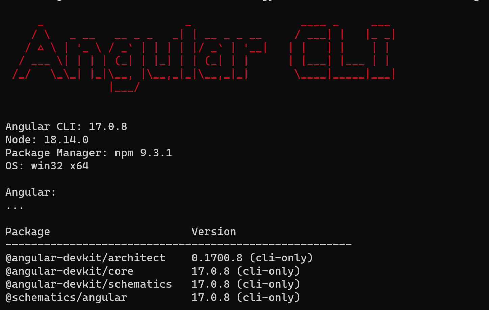

# Angular JS

## Installation

- first check if nodejs is installed or not
- Open the terminal and type `node -v` to see whether it's installed or not. If you get a version number in response it is installed otherwise install it from here [download](https://nodejs.org/en/download)
- Now to install angular js use the following command
    > npm install -g @angular/cli

## Checking if Angular Js is installed

- to check angularJS Version or AngularJS is installed use the following command

    > ng v

    *Output*
    

## Creating a new project 

- to create a angularJS application like myApp - [follow](createAnApplication.md)

## Exercises

### Exercise - 1

#### 1A - Module Name: Angular Application Setup

- Observe the link <http://localhost:4200/welcome> on which the mCart application is running. Perform the below activities to understand the features of the application. - [Solution](https://infyspringboard.onwingspan.com/web/en/viewer/web-module/lex_27130678039600755000_shared?collectionId=lex_20858515543254600000_shared&collectionType=Course&pathId=lex_22423373009981100000_shared)

#### 1B - Module Name: Components and Modules

- Create a new component called hello and render Hello Angular on the page - [solution](exercise-1b.md)

#### 1C - Module Name: Elements of Template

- Add an event to the hello component template and when it is clicked, it should change the courseName - [solution](exercise-1c.md)

### Exercise - 2

#### 2A - Module Name: Structural Directives - ngIf

- Create a login form with username and password fields. If the user enters the correct credentials, it should render a "Welcome <\<username>>" message otherwise it should render "Invalid Login!!! Please try again..." message - [solution](https://infyspringboard.onwingspan.com/web/en/viewer/web-module/lex_auth_0127637402260439042595_shared?collectionId=lex_20858515543254600000_shared&collectionType=Course&pathId=lex_9893896193812204000_shared)

#### 2B - Module Name: ngFor

- Create a courses array and rendering it in the template using ngFor directive in a list format. - [solution](https://infyspringboard.onwingspan.com/web/en/viewer/web-module/lex_32795774277593590000_shared?collectionId=lex_20858515543254600000_shared&collectionType=Course&pathId=lex_9893896193812204000_shared)

#### 2C - Module Name: ngSwitch

- Display the correct option based on the value passed to ngSwitch directive. - [solution](https://infyspringboard.onwingspan.com/web/en/viewer/web-module/lex_23388127475984175000_shared?collectionId=lex_20858515543254600000_shared&collectionType=Course&pathId=lex_9893896193812204000_shared)

#### 2D - Module Name: Custom Structural Directive

- Create a custom structural directive called 'repeat' which should repeat the element given a number of times.  - [solution](https://infyspringboard.onwingspan.com/web/en/viewer/web-module/lex_24073319904331424000_shared?collectionId=lex_20858515543254600000_shared&collectionType=Course&pathId=lex_9893896193812204000_shared)

### Exercise - 3

#### 3A - Module Name: Attribute Directives - ngStyle

- Apply multiple CSS properties to a paragraph in a component using ngStyle. - [solution](https://infyspringboard.onwingspan.com/web/en/viewer/web-module/lex_24037156998765367000_shared?collectionId=lex_20858515543254600000_shared&collectionType=Course&pathId=lex_9893896193812204000_shared)

#### 3B - Module Name: ngClass

- Apply multiple CSS classes to the text using ngClass directive. - [solution](https://infyspringboard.onwingspan.com/web/en/viewer/web-module/lex_3459610297074182000_shared?collectionId=lex_20858515543254600000_shared&collectionType=Course&pathId=lex_9893896193812204000_shared)

#### 3C - Module Name: Custom Attribute Directive

- Create an attribute directive called 'showMessage' which should display the given message in a paragraph when a user clicks on it and should change the text color to red.  - [solution](https://infyspringboard.onwingspan.com/web/en/viewer/web-module/lex_14783742359773809000_shared?collectionId=lex_20858515543254600000_shared&collectionType=Course&pathId=lex_9893896193812204000_shared)

### Exercise - 4

#### 4A - Module Name: Property Binding

- Binding image with class property using property binding. - [solution](https://infyspringboard.onwingspan.com/web/en/viewer/web-module/lex_8951964709153619000_shared?collectionId=lex_20858515543254600000_shared&collectionType=Course&pathId=lex_11698138479856183000_shared)

#### 4B - Module Name: Attribute Binding

- Binding colspan attribute of a table element to the class property - [solution](https://infyspringboard.onwingspan.com/web/en/viewer/web-module/lex_7154252883180625000_shared?collectionId=lex_20858515543254600000_shared&collectionType=Course&pathId=lex_11698138479856183000_shared)

#### 4C - Module Name: Style and Event Binding

- Binding an element using inline style and user actions like entering text in input fields - [solution](exercise-4c.md)

### Exercise - 5

#### 5A - Module Name: Built in Pipes

- Display the product code in lowercase and product name in uppercase using built-in pipes - [solution](https://infyspringboard.onwingspan.com/web/en/viewer/web-module/lex_11810543990912035000_shared?collectionId=lex_20858515543254600000_shared&collectionType=Course&pathId=lex_8545308691879687000_shared)

#### 5B - Module Name: Passing Parameters to Pipes

- Apply built-in pipes with parameters to display product details.  - [solution](https://infyspringboard.onwingspan.com/web/en/viewer/web-module/lex_21187073707540988000_shared?collectionId=lex_20858515543254600000_shared&collectionType=Course&pathId=lex_8545308691879687000_shared)

#### 5C - Module Name:  Nested Components Basics

- Load CourseslistComponent in the root component when a user clicks on the View courses list button. - [solution](https://infyspringboard.onwingspan.com/web/en/viewer/web-module/lex_24231999287700136000_shared?collectionId=lex_20858515543254600000_shared&collectionType=Course&pathId=lex_19488894276985635000_shared)

### Exercise - 6

#### 6A - Module Name: Passing data from Container Component to Child Component

- Creating an AppComponent that displays a dropdown with a list of courses as values in it. Create another component called the CoursesList component and load it in AppComponent which should display the course details. When the user selects a course from the dropdown,  corresponding course details should be loaded.  - [solution](https://infyspringboard.onwingspan.com/web/en/viewer/web-module/lex_15758356947336235000_shared?collectionId=lex_20858515543254600000_shared&collectionType=Course&pathId=lex_19488894276985635000_shared)

#### 6B - Module Name: Passing data from Child Component to ContainerComponent

- Create an AppComponent that loads another component called CoursesList component. Create another component called CoursesListComponent which should display the courses list in a table along with a register button in each row. When a user clicks on the register button, it should send that courseName value back to AppComponent where it should display the registration successful message along with courseName - [solution](https://infyspringboard.onwingspan.com/web/en/viewer/web-module/lex_8617023042439579000_shared?collectionId=lex_20858515543254600000_shared&collectionType=Course&pathId=lex_19488894276985635000_shared)

#### 6C - Module Name: Shadow DOM

- Apply ShadowDOM and None encapsulation modes to components.  - [solution](https://infyspringboard.onwingspan.com/web/en/viewer/web-module/lex_10312243404892470000_shared?collectionId=lex_20858515543254600000_shared&collectionType=Course&pathId=lex_19488894276985635000_shared)

#### 6D - Module Name: Component Life Cycle

- Override component life-cycle hooks and logging the corresponding messages to understand the flow. - [solution](https://infyspringboard.onwingspan.com/web/en/viewer/web-module/lex_5741791208267317000_shared?collectionId=lex_20858515543254600000_shared&collectionType=Course&pathId=lex_19488894276985635000_shared)
