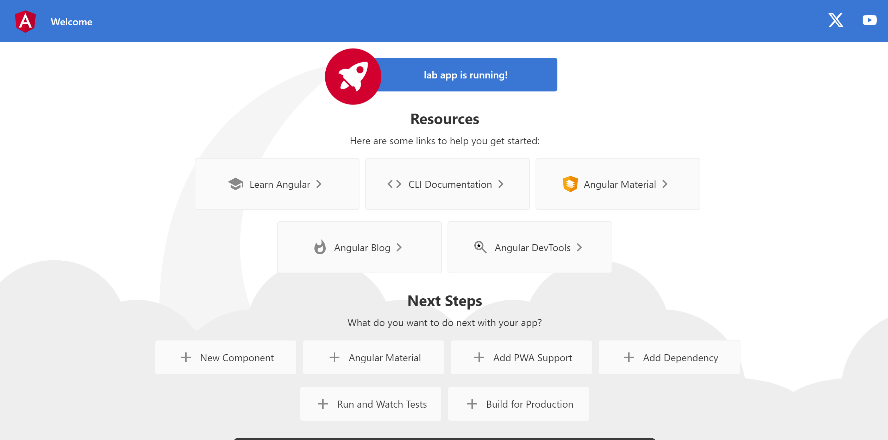

# How to create a An AngularJS application for example myApp

1. Use the following command to create myApp
    > ng new myApp

    *Note - check your angular js version if its `17 or above` then while creating the myApp use the following command*
    > npx @angular/cli@16 new myApp

    - for the question `Would you like to add Angular routing?` enter __`y`__

    - for the question `Which stylesheet format would you like to use?` select `css`

2. Navigate to the myApp directory myApp
    > cd myApp

3. Now run myApp using the following command
    > ng serve --open

    output 

4. Navigate to `src->app->app.component.html` and delete everything
    
    Output - should be a blank white screen

