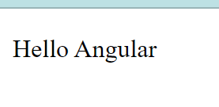

# Exercise - 1B

## Module Name: Components and Modules

### Create a new component called hello and render Hello Angular on the page

#### Instructions

1. First create an angularJS application - [follow](createAnApplication.md)

2. Create a new component `hello` using the following commmand
    > ng g c hello

3. Open `hello.component.ts` and add the following code

    ```ts
    import { Component } from '@angular/core';

    @Component({
        selector: 'app-hello',
        templateUrl: './hello.component.html',
        styleUrls: ['./hello.component.css']
    })
    export class HelloComponent {
        message = 'Hello Angular'
    }

    ```

4. Open `hello.component.html` and add the following code

    ```html
    <p>{{ message }}</p>
    ```

5. Open `app.component.html` and add the following code

    ```html
    <app-hello></app-hello>
    ```

6. Now run the myApp application using the following command
    > ng serve --open

#### Output
