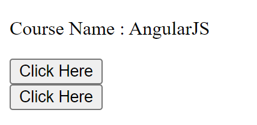

# Exercise - 1C

## Module Name: Elements of Template

### Add an event to the hello component template and when it is clicked, it should change the courseName.

#### Instructions

1. First create an angularJS application - [follow](createAnApplication.md)

2. Create a new component `hello` using the following commmand
    > ng g c hello

3. Open `hello.component.ts` and add the following code

    ```ts
    import { Component } from '@angular/core';

    @Component({
        selector: 'app-hello',
        templateUrl: './hello.component.html',
        styleUrls: ['./hello.component.css']
    })
    export class HelloComponent {
        courseName = 'AngularJS'
        onClick() {
            this.courseName = 'TypeScript'
        }
    }
    ```

4. Open `hello.component.html` and add the following code

    ```html
    <p>Course Name : {{ courseName }}</p>
    <button (click)="courseName = 'NodeJS'">Click Here</button><br>
    <button (click)='onClick()'>Click Here </button>
    ```

5. Open `app.component.html` and add the following code

    ```html
    <app-hello></app-hello>
    ```

6. Now run the myApp application using the following command
    > ng serve --open

#### Output
