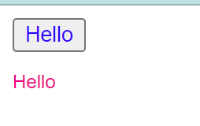

# Exercise - 4C

## Module Name: Style and Event Binding

### Binding an element using inline style and user actions like entering text in input fields.

#### Instructions

1. First create an angularJS application - [follow](createAnApplication.md)

2. Open `app.component.ts` and add the following code

    ```ts
    import { Component } from '@angular/core';

    @Component({
        selector: 'app-root',
        templateUrl: './app.component.html',
        styleUrls: ['./app.component.css']
    })
    export class AppComponent {
        isValid = true
    }
    ```

3. Open `app.component.html` and add the following code

    ```html
    <button [style.color] = "isValid ? 'blue' : 'red' ">Hello</button>
    <p [style.font-size.px] = "isValid ? 12 : 14">Hello</p>
    ```

4. Now run the myApp application using the following command
    > ng serve --open

#### Output
